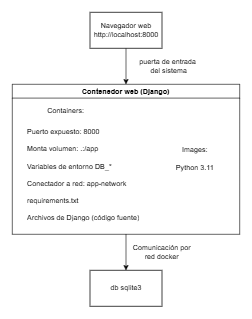
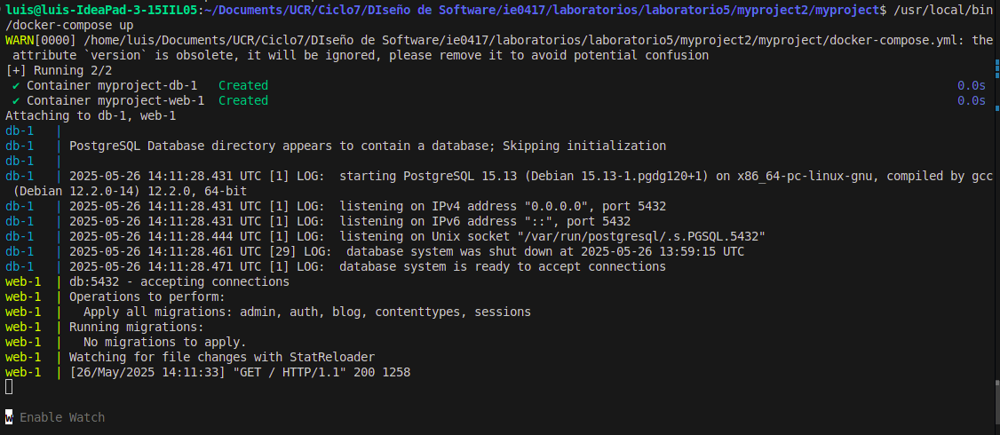
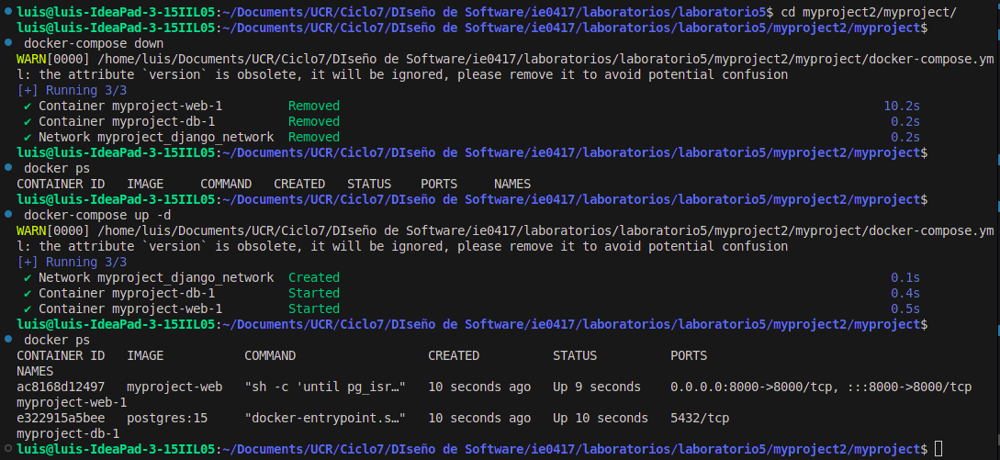
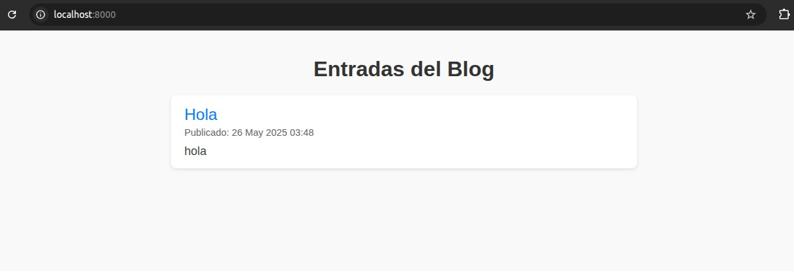
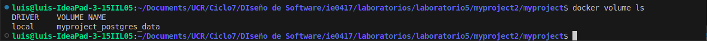

# Laboratorio 5: Despliegue de una aplicación Django con Docker. Infraestructura, persistencia y redes
- Diseño de Software para Ingeniería IE-0417
- Brenda Castro Jiménez C21904
- Byron Arguedas López C10606
- Luis Brenes Campos C21324

# Diagrama de arquitectura del sistema



Resumen del diagrama:
- El navegador en localhost:8000 accede al contenedor web.
- El contenedor web está en la red virtual app-network.
- El contenedor db guarda los datos en un volumen persistente (postgres_data).

# Explicación de archivos de interés

## Creación del Dockerfile 

Este archivo define la imagen personalizada para el contenedor de la aplicación Django. A continuación se explica cada parte del Dockerfile:

### 1. Imagen base y directorio de trabajo

```python
FROM python:3.10-slim

WORKDIR /app
```

- Se usa la imagen oficial de Python 3.10 en su variante "slim" para mantener la imagen ligera.

- Se establece `/app` como directorio de trabajo dentro del contenedor; ahí se ejecutarán los comandos siguientes.

### 2. Copiar archivo de dependencias y preparar instalación

```python
COPY requirements.txt /app/
```

- Se copia el archivo `requirements.txt` (lista de librerías Python necesarias) al directorio `/app` del contenedor.

### 3. Instalar cliente PostgreSQL

```python
RUN apt-get update && apt-get install -y postgresql-client && rm -rf /var/lib/apt/lists/*
```
- Se actualizan los paquetes del sistema e instala el cliente `postgresql-client` para disponer de la herramienta `pg_isready`.

- Esta herramienta es útil para verificar si la base de datos PostgreSQL está lista antes de iniciar la aplicación Django.

- Se limpia la caché de paquetes para reducir el tamaño de la imagen.

### 4. Instalación de dependencias Python

```python
RUN pip install --upgrade pip
RUN pip install -r requirements.txt
```

- Se actualiza `pip` a la última versión para evitar problemas de instalación.

- Se instalan todas las librerías Python listadas en `requirements.txt`.

### 5. Copiar todo el código fuente

```python
COPY . /app/
```
- Se copia todo el contenido del proyecto (código Python, templates, configuraciones, etc.) al directorio `/app` dentro del contenedor.

### 6. Exponer puerto 8000

```python
EXPOSE 8000
```

- Se indica que la aplicación web escuchará por el puerto 8000, para que Docker pueda mapearlo hacia el host.

### 7. Comando para iniciar el contenedor

```python
CMD ["sh", "-c", "until pg_isready -h db -p 5432; do echo 'Waiting for Postgres...'; sleep 2; done; python manage.py migrate && python manage.py runserver 0.0.0.0:8000"]

```
- Este comando hace que el contenedor espere hasta que el servicio de PostgreSQL (`db`) esté listo y aceptando conexiones en el puerto 5432.

- Una vez disponible, ejecuta las migraciones de Django para crear/actualizar las tablas en la base de datos.

- Finalmente, arranca el servidor web de Django escuchando en todas las interfaces (`0.0.0.0`) en el puerto 8000.

## Archivo .env

El archivo `.env` contiene las variables de entorno necesarias para configurar tanto la base de datos PostgreSQL como la aplicación Django. Usar un archivo `.env` permite separar las configuraciones sensibles y variables que pueden cambiar entre ambientes sin modificar el código.

```python
POSTGRES_USER=admin
POSTGRES_PASSWORD=12345
POSTGRES_DB=midb
DJANGO_SECRET_KEY=F1e2D3c4B5a6G7h8I9j0KlMnOpQrStUvWxYz1234567890abcdef
```

### Explicación de cada variable

- **POSTGRES_USER**: Define el nombre de usuario que PostgreSQL utilizará para la autenticación en la base de datos. En este caso, es admin.

- **POSTGRES_PASSWORD**: Contraseña asociada al usuario definido en `POSTGRES_USER`. En este ejemplo es 12345.

- **POSTGRES_DB**: Nombre de la base de datos que PostgreSQL creará y a la que la aplicación Django se conectará. Aquí se llama midb.

- **DJANGO_SECRET_KEY**: Clave secreta usada por Django para funciones internas como la gestión de sesiones, cifrado y seguridad. (Clave de ejemplo en este caso).

## Archivo docker-compose.yml

Este archivo es el encargado de orquestar los contenedores Docker para la aplicación. Define los servicios necesarios, redes, volúmenes y cómo se relacionan.

### 1. Servicio db (PostgreSQL)

```python
db:
  image: postgres:15
  restart: always
  env_file:
    - .env
  volumes:
    - postgres_data:/var/lib/postgresql/data
  networks:
    - django_network
```

- Usa la imagen oficial de PostgreSQL versión 15.

- `restart: always` garantiza que el contenedor se reinicie si falla.

- Carga variables de entorno desde el archivo `.env` para usuario, contraseña y base de datos.

- Usa un volumen Docker llamado `postgres_data` para persistir los datos de la base, montado en la ruta estándar de PostgreSQL `/var/lib/postgresql/data`.

- Se conecta a una red Docker personalizada llamada `django_network` para comunicarse con otros servicios.

### 2. Servicio web (Django)

```python
web:
  build: .
  command: sh -c "until pg_isready -h db -p 5432; do echo 'Waiting for Postgres...'; sleep 2; done; python manage.py migrate; python manage.py runserver 0.0.0.0:8000"
  volumes:
    - .:/app
  ports:
    - "8000:8000"
  env_file:
    - .env
  depends_on:
    - db
  networks:
    - django_network
```

- El servicio web construye la imagen Docker usando el Dockerfile ubicado en la carpeta actual (`build: .`). El comando `command` hace que el contenedor espere a que PostgreSQL esté listo (utilizando `pg_isready`) antes de ejecutar las migraciones y levantar el servidor Django en el puerto 8000.

- Además, monta la carpeta actual (`.`) en `/app` dentro del contenedor, lo que facilita el desarrollo en caliente, permitiendo que los cambios en el código se reflejen sin reconstruir la imagen. El puerto 8000 del contenedor se expone para que la aplicación sea accesible desde el host.

- Este servicio utiliza las mismas variables de entorno definidas en el archivo `.env`. También declara una dependencia para que el contenedor de la base de datos `db` esté activo antes de iniciar (`depends_on`) y se conecta a la red personalizada `django_network` para comunicarse con dicho contenedor.


### 3. Volúmenes Docker

```python
volumes:
  postgres_data:
```

- Define un volumen persistente llamado `postgres_data` para guardar los datos de la base PostgreSQL fuera del contenedor, garantizando que los datos no se pierdan al parar o eliminar contenedores.

### 4. Redes Docker

```python
networks:
  django_network:
    driver: bridge
```

Define una red Docker personalizada llamada `django_network` usando el driver por defecto `bridge`.

Esto permite que los contenedores `web` y `db` se comuniquen por nombre de servicio (p. ej., db).


# Instrucciones de uso

### Preparación del entorno

- Tener Docker y Docker Compose instalados y funcionando.  
- Tener la carpeta con todos los archivos del proyecto: `Dockerfile`, `docker-compose.yml`, `.env`, `requirements.txt` y el proyecto Django (`manage.py`, carpetas `myproject/`, `blog/`).

### Creación y uso de los contenedores

- Desde una terminal ubicada en la raíz del proyecto, ejecutar:  
  ```bash
  docker-compose up --build
- Esto construye la imagen Django, levanta PostgreSQL, aplica migraciones y arranca el servidor Django en http://localhost:8000/. Abre esa dirección en tu navegador para ver la página.
- Para acceder al panel administrativo, usa: http://localhost:8000/admin
- Para detener y eliminar los contenedores (manteniendo los datos), ejecuta: `docker-compose down`.
- Cuando quieras volver a usar la aplicación, desde la carpeta del proyecto ejecuta: `docker-compose up -d`.
- Para monitorear los logs de la aplicación y la base de datos: `docker-compose logs -f`.

# Funcionaminto del programa 

A continuación se presentan algunas capturas de pantallas que prueban el funcionamiento del docker y la aplicación django. 




Esta captura muestra la ejecución del comando `docker-compose up -d` dentro de un entorno virtual en Linux para levantar los contenedores definidos en el archivo `docker-compose.yml`.

Luego, confirma que se crearon y arrancaron correctamente tres componentes: una red Docker llamada `myproject_django_network`, un contenedor de base de datos PostgreSQL (`myproject-db-1`) y un contenedor para la aplicación Django (`myproject-web-1`). La salida del comando `docker ps` confirma que ambos contenedores están activos y corriendo: el contenedor web está escuchando en el puerto 8000 y el contenedor de PostgreSQL en el puerto 5432, lo cual indica que la aplicación Django y la base de datos están funcionando y comunicándose a través de la red creada.



En esta imagen se muestra que los contenedores cierran un run que tenían anteriormente y se inician de nuevo de manera correcta.

Al abrir los logs se desplegan los mensajes de inicio, migraciones aplicadas y servidor Django corriendo con el mensaje "database system is ready to accept connections”. Al refrescar la paǵina que está disponible en "http://localhost:8000/" envia el mensaje:

```python
web-1  | [26/May/2025 08:36:05] "GET / HTTP/1.1" 200 1446
```
La línea del log indica que el contenedor llamado `web-1` registró una petición realizada el 26 de mayo de 2025 a las 08:36:05. La solicitud fue un método HTTP GET a la ruta raíz `/` usando el protocolo HTTP versión 1.1. El servidor respondió con un código 200, lo que significa que la página se entregó correctamente, enviando una respuesta de 1446 bytes al cliente.



La página al refrescarse se muestra así, demostrado que guarda el último estado de la página, este post se había realizado anteriormente.



En esta figura se muestra el uso del comando `docker volume ls` que muestra el volumen `myproyect_postgres_data` existente y en uso.
